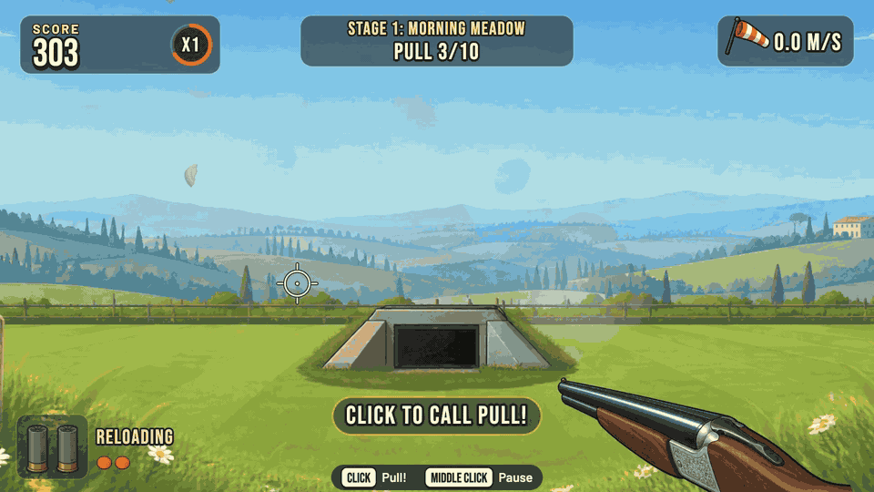

# Clay Rush

[](https://github.com/collecticraft-sudo/clay-rush/actions/workflows/test.yml)




*Real gameplay (Classic on Easy), captured frame by frame from the running game and played by the built-in test bot. Nobody is holding a Joy-Con here.*

**Shoot clays by turning a Joy-Con like a pistol.** Clay Rush is a clay pigeon shooting game that runs in your browser. Call "Pull!", the clays fly out of the trap houses over the Tuscan countryside, and you aim by turning a Nintendo Switch 2 **Joy-Con 2** in your hand: **ZR** is the trigger. No Joy-Con? The mouse and a built-in simulator work too.

It is a small web game with no dependencies: a tiny Node server, plus a native Bluetooth helper for macOS.

**Watch the presentation video:** download `clay-rush-presentation.mp4` from the [v1.0.0 release](https://github.com/collecticraft-sudo/clay-rush/releases/tag/v1.0.0). It shows real gameplay played by a bot.

## Play it in two minutes

```bash
git clone https://github.com/collecticraft-sudo/clay-rush.git
cd clay-rush
./start.command        # or: npm start, then open http://localhost:8141
```

You need a Mac, [Node.js](https://nodejs.org) 22 or newer (`brew install node`) and Google Chrome. For a real Joy-Con 2 you also need Apple's Command Line Tools (`xcode-select --install`), because the Bluetooth helper is compiled once, on first start.

No controller? On the connect screen choose **Simulator** or **Mouse**, or open `http://localhost:8141/?input=mouse`.

## Using a real Joy-Con 2

1. Hold the Joy-Con 2 (R) like a pistol: its top towards the screen, ZR under your index finger, wrist strap on.
2. Start the game with `start.command` (from Terminal) and accept the safety screen. The first time, macOS asks whether Terminal may use Bluetooth: choose **Allow**.
3. Press **Connect Joy-Con** and hold the controller's **SYNC** button (next to the USB-C port) until its lights sweep. Never pair it in the macOS Bluetooth settings.
4. Calibrate (about 15 seconds): hold it still, point it at the screen, centre your aim, then shoot the practice clay. The first hit opens the menu.

You hold SYNC again every session. The [guide](docs/GUIDE.md) has the whole procedure and the troubleshooting.

## How to play

Press ZR to call "Pull!", turn the Joy-Con to swing the crosshair onto the clay, lead it a little and press ZR again. You have **two shells per pull**. R brings the crosshair back to the centre of the screen.

- **Classic**: a tour of three stages (Morning Meadow, Golden Hills, Alpine Dusk), 26 pulls and 36 clays, ranked S to D.
- **Time Attack**: 90 seconds on one stage. Clays come in waves of one or two, each wave refills the gun, every break adds time.
- **Zen**: practice at your pace. No score, no clock, unlimited shells.

**Difficulty is distance**: Easy brings the same throws closer (bigger clays, a wider pattern, half the wind), Hard sends them farther and the pellets take a moment to arrive, so you must lead. **Scoring**: 100 points per clay (more for minis, rabbits and the gold clay), bonuses for a centre hit ("SMOKED!"), the first barrel, long shots and doubles, all multiplied by a streak of up to x4. Best scores stay in your browser. The game never uses the network.

| | Right Joy-Con | Mouse | Keyboard |
|---|---|---|---|
| Aim | turn the Joy-Con | move the mouse | none |
| Shoot / call "Pull!" | ZR (A also calls "Pull!") | left click | F (Enter calls "Pull!") |
| Recentre the aim | R | double click | C or Space |
| Pause | + | middle click | P or Esc |
| Menus | stick, A, B | click, right click to go back | arrow keys, Enter, Esc |

**M** mutes. The setting "Trigger" swaps ZR and R. The Left Joy-Con, every setting and the rules in detail are in [the reference](docs/REFERENCE.md).

## Safety

You are pointing a controller like a gun in a room. **Never point it at people or pets, even as a joke.** Keep 2 metres of free space around you and keep fragile things away. Always use the wrist strap. Take a break every 15 minutes, and stop if your wrist, arm or shoulder hurts. The game has bright flashes: Settings has "Reduce flashes" and "Reduce motion". The game's first screen says all this.

## Honest status

Nobody on the team could touch a real Joy-Con 2 except the owner, so only what the owner saw on real hardware counts as checked.

- **Checked on one real Joy-Con 2 Right, in the previous game that shares this input stack:** it connects through the native bridge and streams at a steady 33 reports per second; the sensor scales and noise (`docs/hardware-findings.md`).
- **Not checked for Clay Rush (UNVERIFIED-ON-HARDWARE):** the owner has played Clay Rush with the mouse only, not yet with the real Joy-Con. How the trigger feels, the default trigger compensation of 40 ms, the rumble, the aim gains and the aim stability are all guesses until then.
- Test results and speed numbers come from the development Mac (headless Chrome). They say nothing about your hardware.

A 10-minute [hardware checklist](docs/GUIDE.md#10-hardware-checklist) in the guide turns those open items into facts, and the [recording session](docs/GUIDE.md#12-the-recording-session) measures the real trigger jerk with `tools/record-imu.mjs` and `tools/analyze-shots.mjs`. The full status is in [`docs/FINAL-STATUS.md`](docs/FINAL-STATUS.md).

## Something not working?

| Symptom | What to do |
|---|---|
| "macOS does not let this app use Bluetooth" | Quit, start again with `start.command` from Terminal and answer **Allow**. Already refused: System Settings > Privacy & Security > Bluetooth, switch Terminal on. |
| "No Joy-Con found." | Hold SYNC until the lights sweep, close to the Mac. Switch the console off. After many tries wait a minute. |
| "Native bridge not available" | Run `xcode-select --install` once, then start again with `start.command`. The mouse and the simulator work meanwhile. |
| The crosshair drifts or moves the wrong way | Press R to recentre; "Flip left and right" in Settings; calibrate again. |
| No sound | Click once anywhere on the page, then check `M` and the volume setting. |

More answers are in the guide's [troubleshooting table](docs/GUIDE.md#9-troubleshooting).

## For developers

```bash
npm test             # everything: unit, integration and headless-Chrome end-to-end (needs Chrome)
npm run test:unit    # everything except the browser tests
```

Zero dependencies, and the tests use Node's built-in runner only. Some URL flags (all optional, joined with `&`):

| Flag | Effect |
|---|---|
| `input` | `native`, `joycon`, `sim` or `mouse`: choose the control method at start |
| `mode` | `classic`, `timeattack` or `zen`: skip the menu (with `difficulty` and `stage`) |
| `seed` | a fixed seed, so every round throws the same clays |
| `assets` | `0` turns the generated art off: the procedural drawing takes over and no picture or font file is requested (`?assets=0`) |
| `debug` | `1` checks every game snapshot and event against the contracts (problems go to the console) |

All the flags, the `window.__clay` automation API, the settings, performance numbers, the project layout, the tools and the known limitations are in [`docs/REFERENCE.md`](docs/REFERENCE.md). The module contracts are in [`docs/architecture.md`](docs/architecture.md) and every game number in [`docs/game-design.md`](docs/game-design.md). What the previous game learned about motion controls is in the [3D Fruit Dojo playbook](https://github.com/collecticraft-sudo/3d-fruit-dojo/blob/main/playbook/NEW-GAME-PLAYBOOK.md).

## Credits and licences

- Game design, direction and play testing: collecticraft-sudo.
- Fonts: Bebas Neue and Barlow (SIL OFL 1.1). Video music: Sascha Ende (ende.app), CC BY 4.0. Video sound effects: Kenney (kenney.nl), CC0. The Joy-Con 2 protocol comes from public community research (ndeadly, Peterksharma, JoeGeC, TheFrano, seitanmen, mascii and others). The full list is in [`CREDITS.md`](CREDITS.md).
- **Code: MIT** ([`LICENSE`](LICENSE)). **Art, logo, name and video: all rights reserved** ([`LICENSE-ASSETS.md`](LICENSE-ASSETS.md)): you may run the game and look at the art, but not reuse it elsewhere without permission.
- **Nintendo, Nintendo Switch 2 and Joy-Con are trademarks of Nintendo. This project is not affiliated with, endorsed by or sponsored by Nintendo.** It talks to the controller over standard Bluetooth Low Energy, using public community research.

*Forked from [3D Fruit Dojo](https://github.com/collecticraft-sudo/3d-fruit-dojo), the owner's sword game: the Bluetooth stack, the native bridge and the motion pipeline come from there. The code name `clay-shooter` stays in the package name; the debug API is `window.__clay`.*
