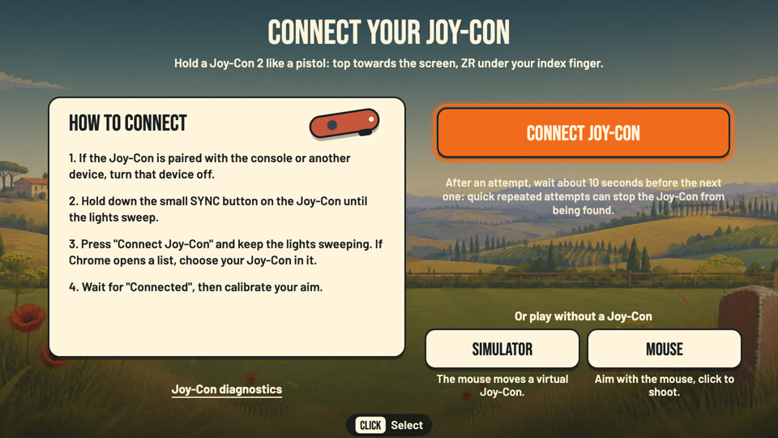
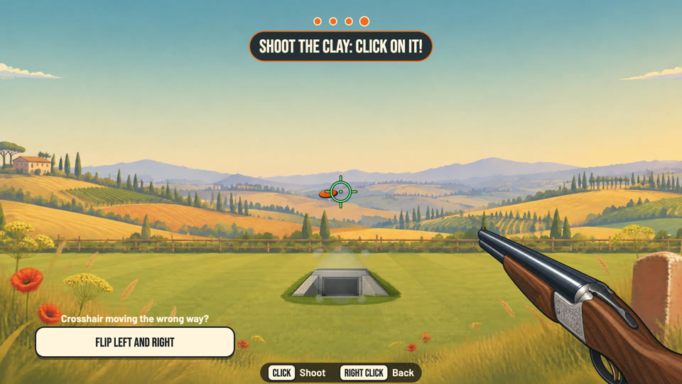
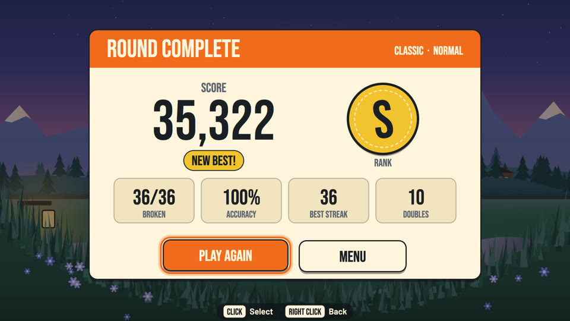
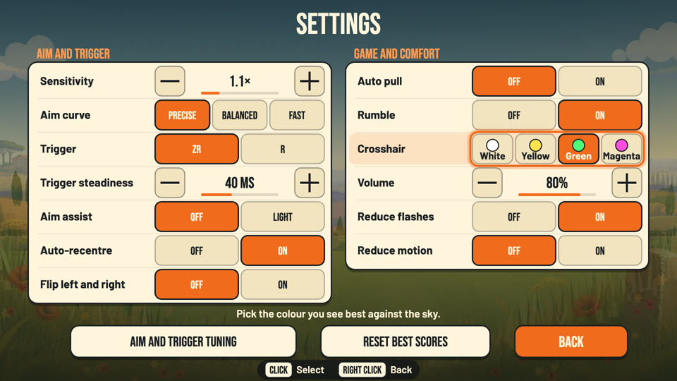
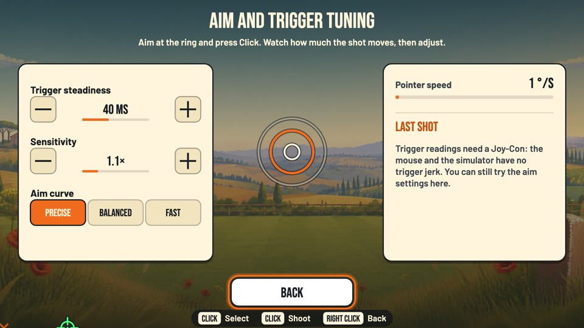

# Clay Rush: the guide

Everything a player and the owner need: starting the game, connecting and calibrating the Joy-Con 2, the controls, the modes, the
settings, troubleshooting, the 10-minute hardware checklist for the first session with the real controller, and the recording session
that measures the trigger. The [README](../README.md) is the short version and [the reference](REFERENCE.md) has every flag and number.
On-screen labels are quoted exactly as the game shows them.

> **Read this first.** Nothing about shooting was tried on a real Joy-Con 2: the owner has played Clay Rush with the mouse only. The
> trigger, the aim while swinging, the rumble and the default trigger compensation are guesses until the checklist of
> [section 10](#10-hardware-checklist) and the [recording session](#12-the-recording-session) have been done. Section 11 lists what is
> still unverified.

## Contents

1. [What Clay Rush is](#1-what-clay-rush-is)
2. [What you need](#2-what-you-need)
3. [Start the game](#3-start-the-game)
4. [Connect and calibrate the Joy-Con](#4-connect-and-calibrate-the-joy-con)
5. [Controls](#5-controls)
6. [Modes, stages and scoring](#6-modes-stages-and-scoring)
7. [Settings](#7-settings)
8. [URL flags and the debug API](#8-url-flags-and-the-debug-api)
9. [Troubleshooting](#9-troubleshooting)
10. [HARDWARE CHECKLIST](#10-hardware-checklist)
11. [UNVERIFIED-ON-HARDWARE](#11-unverified-on-hardware)
12. [The recording session](#12-the-recording-session)
13. [Tests](#13-tests)

## 1. What Clay Rush is

A first-person clay pigeon shooting game in a stylised Tuscan countryside. You stand at the shooting station with an over-and-under
shotgun (two shells per pull), call "Pull!", the clays fly out of the trap houses and you shoot them before they land. Doubles slow the
world down for a moment, centre hits are "SMOKED!", a streak raises the multiplier up to x4. A Classic round takes about three minutes.

The controller is a Nintendo Switch 2 **Joy-Con 2**, held like a pistol: turning it moves the crosshair (the gyroscope), **ZR** is the
trigger. The mouse and a built-in simulator work too, so the whole game can be played and tested without a controller.

## 2. What you need

| Item | Notes |
|---|---|
| Mac | With Bluetooth. Developed on macOS 26. |
| Node.js | 22 or newer: `brew install node`. |
| Command Line Tools | Once, for the native Bluetooth bridge: `xcode-select --install`. Without them the mouse and the simulator still work. |
| Browser | Google Chrome (`start.command` opens it). The native bridge works in any modern browser; Chrome's Web Bluetooth path needs Chrome. |
| Joy-Con | A Switch 2 Joy-Con 2, right unit recommended (the left unit is supported but never tried). Charged, wrist strap on. Optional. |

## 3. Start the game

Double-click **`start.command`** (or run `./start.command` in Terminal). It checks Node.js, prepares the native bridge, starts the server
on **port 8141** and opens Chrome at `http://localhost:8141`. Keep the Terminal window open while you play (it also keeps the display
awake); `Ctrl+C` there quits. If a server already runs, it simply opens the page again.

Start it from Terminal, not from another app: macOS gives the Bluetooth permission to the app that started the bridge, and the first
time it asks whether Terminal may use Bluetooth: choose **Allow**. If macOS refuses to open the file because it was downloaded:
right-click it, choose Open, or run `chmod +x start.command` and `xattr -d com.apple.quarantine start.command` in the folder.

Other ways: `npm start`, or `PORT=8200 node server.js` for another port. Always `localhost`, never the network address of the Mac
(the bridge only answers that origin, and Web Bluetooth needs a secure page).

The first screen is **"BEFORE YOU PLAY"**: clear two metres around you, wrist strap on, never point the Joy-Con at people or pets, a
break every 15 minutes, and a "REDUCE FLASHES" switch. "GOT IT, LET'S SHOOT" unlocks after two seconds.

## 4. Connect and calibrate the Joy-Con

**Connect.** On the connect screen press **"CONNECT JOY-CON"** (native bridge), then right away hold the small **SYNC** button of the
Joy-Con (next to the USB-C port) until the lights sweep. The progress line follows the bridge ("Looking for the Joy-Con. Hold SYNC now
until the lights sweep.", "Joy-Con found. Connecting…"); when it says "Connected" the game moves on to the calibration. Never pair the
Joy-Con in the macOS Bluetooth settings. "NOT WORKING? TRY CHROME'S BLUETOOTH" is the second path (Chrome's device list; "CAN'T SEE IT?
EXTENDED SEARCH" lists every device). The **SIMULATOR** and **MOUSE** buttons skip the controller. "Joy-Con diagnostics" opens the
sensor test page (the game lets go of the controller first: one Bluetooth link at a time).



**Calibrate** (four steps, about 15 seconds):

1. "HOLD IT STILL": the Joy-Con still, top pointing up (or standing on a table). The game measures the gyro bias and gravity.
2. "POINT AT THE SCREEN": point it at the screen like a pistol and hold still.
3. "CENTRE YOUR AIM": aim at the centre of the screen and press **A** (or hold still for 3 seconds).
4. "SHOOT THE CLAY": a practice round. One slow clay every 3 seconds from the trap house; the first hit ends the calibration and opens
   the menu. "Crosshair moving the wrong way?" offers "FLIP LEFT AND RIGHT"; after a few misses "CALIBRATE AGAIN" appears.



"JUST RECENTRE" ("Same grip as before? Just recentre.") on step 1 skips the wizard when the Joy-Con is the one already calibrated. During
play, **R** recentres the aim on the screen centre (the pause panel has "RECENTRE AIM" too). The simulator needs no calibration
(`?simcal=1` runs the real wizard against its scripted gun). The calibration is not remembered between sessions.

If the link drops during a round the game pauses under "JOY-CON DISCONNECTED": hold SYNC and press "RECONNECT", or "CONTINUE WITH THE
MOUSE".

## 5. Controls

| Action | Joy-Con 2 R | Mouse | Keyboard |
|---|---|---|---|
| Aim | turn the Joy-Con | move the mouse | (arrows in menus) |
| Shoot / call "Pull!" | **ZR** (A calls "Pull!" too) | left click | **F** (Enter calls "Pull!") |
| Recentre | **R** | double click | **C** or Space |
| Pause / resume | **+** | middle click | **P** or **Esc** |
| Menus | stick to move, **A** select, **B** back | point and click, right click back | arrows, Enter, Esc |
| Mute | | | **M** |

Left unit: ZL shoots, L recentres, minus pauses; in menus Down selects and Left goes back. The setting "Trigger" makes **R** the trigger
and ZR the recentre button. A real Joy-Con never selects a menu item by pointing at it (no accidental starts): the stick, A and B only.
The bottom line of every screen shows the buttons of the controller you used last. The rail buttons (SL, SR), HOME and the stick clicks
are never used.

## 6. Modes, stages and scoring

| Mode | What happens |
|---|---|
| **Classic** | "Tour of the range". Three stages in order: 1 Morning Meadow (10 pulls, singles from the trap house, a mini near the end), 2 Golden Hills (8 pulls: crossers, doubles, a gold clay, steady wind), 3 Alpine Dusk (8 pulls: tower, rabbits, a battue double, gusts). 36 clays. Two shells per pull, and you call each pull ("PRESS ZR TO CALL PULL!", or the setting "Auto pull"). A stage card shows between stages. Rank by the share of clays broken: S 95, A 85, B 70, C 50 percent, D below. |
| **Time Attack** | 90 seconds on the stage you choose. The clays come **one wave at a time**: a single or a double (doubles from 15 percent of the waves at the start to 60 percent at 90 s), and every wave **refills the gun to two shells**, so there are never more clays in the air than shells. The next wave starts when every clay of the previous one is broken or lost, after a gap that shrinks from 1.4 s to 0.5 s. Two misses leave the gun empty until the next wave. Every break adds time: +1.5 s for the first 20 breaks, +0.75 s up to break 40, then +0.25 s (at most 120 s on the clock). Ends ("TIME!") at 0 or after 3 minutes. Rank by score: S 9000, A 6500, B 4500, C 2500. |
| **Zen** | No score, no clock, unlimited shells. Slow clays (x0.8) at the Easy distance with a wider pattern (x1.3), one wave at a time. Pause and "END SESSION" shows hits and accuracy. |

**Points**: 100 per clay (150 for a mini, a battue or a rabbit, 300 for the gold clay), +50 for a centre hit ("SMOKED!"), +25 for a
clay broken with the first barrel, +4 per metre beyond 25 m, +100 for both clays of a double ("DOUBLE!"), +200 for two with one shot,
+500 for a perfect stage. Everything is multiplied by the streak: x2 from 3 breaks in a row, x3 from 6, x4 from 10. A lost clay resets
the streak; a miss alone does not.

**Difficulty is distance** (Classic and Time Attack). The same throws are shown closer or farther: the world is scaled by **0.55** on
Easy, **1** on Normal and **1.45** on Hard. A standard clay is 0.6 m wide, so on Easy it looks about 1.8 times bigger than on Normal
and on Hard about 0.7 times as big; the shot pattern scales the same way. The backdrop zooms with it (in on Easy, out on Hard; an
instant cut with "Reduce motion"). Easy also has slower clays (x0.9), a wider pattern (x1.15) and half the wind. Hard keeps the Normal
speed and pattern but adds **pellet travel time** (650 m/s, so the shot lands a few tens of milliseconds after the press): lead the clay.
Best scores are kept per mode, difficulty and, for Time Attack, stage ("BEST SCORES" in the menu), in this browser only.



## 7. Settings

| Setting | Range and default | What it does |
|---|---|---|
| Sensitivity | 0.5x to 3.0x, default 1.0x | Multiplies the whole aim curve: how far the crosshair moves for a turn of the wrist. |
| Aim curve | Precise, **Balanced**, Fast | The crosshair moves more per degree the faster you turn. Precise: 6 px per degree when turning slowly, up to 17 when fast. Balanced: 8 to 24. Fast: 11 to 32. The vertical gain is capped a little lower (13, 19, 25). |
| Trigger | **ZR** or R | The button that shoots; the other one recentres. |
| Trigger steadiness | 0 to 100 ms in steps of 10, default **40** | The shot uses the aim from this long before the press, so the jerk of pulling the trigger does not move the shot. Joy-Con only (the mouse and the simulator use 0). |
| Aim assist | **Off** or Light | Light: a 15 percent wider pattern that leans towards a close clay; results are marked "assist". |
| Auto-recentre | **On** or off | When you hold still, the crosshair glides back to the centre (counters gyro drift). |
| Flip left and right | **Off** or on | For a mirrored aim. |
| Auto pull | **Off** or on | Classic calls "Pull!" by itself 1.2 s after the gun is loaded. |
| Rumble | **On** or off | A short rumble on every shot (`?haptics=0` turns it off for the session). |
| Crosshair | **White**, yellow, green or magenta | Pick the colour you see best against the sky. |
| Volume | 0 to 100 percent, default 80 | **M** mutes at any time. |
| Reduce flashes, Reduce motion | **Off** or on | No white flashes; no shake, slow motion, zoom or parallax. |

The values above in bold are the defaults. The aim gains are 1.6 times those of the previous game's sword, raised after the owner's
first play session ("not sensitive enough"); how they feel on a real Joy-Con is UNVERIFIED-ON-HARDWARE.



**"AIM AND TRIGGER TUNING"** (bottom of the settings): a live crosshair over a ring, the "Pointer speed" in degrees per second, and after
each trigger press the "Trigger jerk" (peak turn rate in the 150 ms after the press) and "Shot moved" (how far the aim moved between the
compensated point and 80 ms after the press). Use it to choose "Trigger steadiness": hold the crosshair on the ring, press ZR ten times,
and raise the value until "Shot moved" stays small. With the mouse there is no trigger jerk, so the readings need a Joy-Con.



## 8. URL flags and the debug API

Every flag and the whole `window.__clay` API are in [the reference](REFERENCE.md#url-flags). Three worth knowing:

- `?assets=0` turns every picture file off: the backdrops, clays, gun and icons are then drawn procedurally. Use it if a picture looks
  broken or the disk is slow; the game plays exactly the same.
- `?input=mouse&mode=classic&difficulty=easy` starts a Classic round on Easy with the mouse at once.
- `?haptics=0` turns the rumble off for the session.

## 9. Troubleshooting

| Problem | What to do |
|---|---|
| The bridge is not offered, "Native bridge not available" | Install the Command Line Tools (`xcode-select --install`) and start the game again with `start.command`. |
| macOS never asked for Bluetooth, or the bridge says it is not allowed | System Settings > Privacy & Security > Bluetooth: turn on Terminal; restart with `start.command`. |
| "No Joy-Con found." | Console off, hold SYNC until the lights sweep, keep it close. After several attempts wait the "TRY AGAIN IN" countdown, or a minute. |
| "The Bluetooth bridge is already in use" | Another game tab or `tools/record-imu.mjs` holds the bridge: close it and try again. |
| The crosshair drifts | Press R to recentre; leave "Auto-recentre" on; calibrate again with the Joy-Con resting still in step 1. |
| The crosshair moves the wrong way | "Flip left and right" (setting, or on calibration step 4); calibrate again. |
| The crosshair is too slow or too fast | Change "Aim curve" first, then "Sensitivity" (up to 3.0x). |
| Shots land beside the clay you aimed at | Lead moving clays (on Hard always); try "Trigger steadiness" 50 to 70 ms and the tuning screen. |
| Pictures missing or wrong | Reload; `?assets=0` plays with the procedural drawing. |
| No sound | Click once anywhere on the page (a Chrome rule), then check **M** and the volume. |
| The display sleeps | Keep the `start.command` window open (it runs `caffeinate`). |

## 10. HARDWARE CHECKLIST

*The 10-minute first session with the real controller.* Do it before trusting any number of the game. Write down what you see for each
step (a phone note is enough) and give it to the lead; the [recording session](#12-the-recording-session) (`tools/record-imu.mjs` with
`tools/shooting-steps.json`) comes right after it.

1. **Connect (2 min).** Joy-Con 2 R charged, console off. `start.command`, "CONNECT JOY-CON", hold SYNC. Note: did macOS ask for
   Terminal's Bluetooth permission, how long until "Connected", which side the screen shows. Then "Joy-Con diagnostics" once: packet rate
   (about 33 or 66 per second), the rest check, the buttons ZR, R, A, B, plus, stick. Settles UOH-1, UOH-2, UOH-3, UOH-4, UOH-8, UOH-12,
   UOH-16, UOH-19, UOH-21, UOH-22, UOH-23, UOH-24, UOH-27, UOH-30, UOH-31, F1, F2, F5.
2. **Calibration (1 min).** Do the four steps with a pistol grip. Note: did step 1 pass at the first try, did step 2 accept the "point
   at the screen" pose, does the crosshair move the same way as your wrist (left is left, up is up). Settles UOH-6, UOH-7, UOH-20, F3,
   F4, HW-7, HW-11.
3. **Aim stability (2 min).** In Zen, rest your arm and hold the crosshair on a fixed point for 10 seconds, three times. It should wander
   by less than about 10 px (a few crosshair line widths). Then rest the Joy-Con on the table for 30 s: does the crosshair drift? Does R
   bring it back? Try the three aim curves once each and note the one that felt right. Settles HW-1, HW-2, HW-3, HW-10, UOH-18.
4. **Trigger feel (2 min).** Settings, "AIM AND TRIGGER TUNING". Hold on the ring and press ZR ten times at "Trigger steadiness" 0, 40 and
   80 ms. Note the "Trigger jerk" and "Shot moved" numbers each time and which value felt fair. Try the trigger setting R once. Settles
   UOH-10, HW-9 and the default of 40 ms.
5. **Rumble (1 min).** Play Classic stage 1: is there a short rumble on every shot? Is it too strong, too weak, late, or does it disturb
   the aim or the stream? Turn "Rumble" off and on again. Settles UOH-13, UOH-15, UOH-29, F6.
6. **A full round (2 min).** Classic on Normal to the end, then one pull with a deliberate miss. Note anything that felt laggy (the time
   between the press and the boom), clays you were sure you hit, and whether the stick, A and B work in every menu. Settles UOH-18, HW-4,
   HW-5, UOH-26.
7. **Battery and the link (30 s).** Note the battery line (a "Joy-Con battery low" toast?) and the percentage of the diagnostics page.
   Then walk 5 m away for a moment and come back: does the "JOY-CON DISCONNECTED" panel appear, and does "RECONNECT" work (hold SYNC if
   asked)? Settles UOH-5, UOH-9, UOH-11, UOH-14, UOH-17, UOH-25, UOH-28, UOH-32, UOH-33.

The ids are the UNVERIFIED-ON-HARDWARE items of `docs/joycon2-protocol.md` (section 12, UOH-1 to UOH-33), of the native bridge
(`docs/native-bridge.md`), of the inherited motion design (HW-1 to HW-11) and of the protocol audit (F1 to F6,
`docs/legacy-fruit-dojo/protocol-audit.md`). An item not covered by a step above is settled by simply using the game: report anything odd.

## 11. UNVERIFIED-ON-HARDWARE

Nothing about shooting was tried on a real Joy-Con 2. In particular these are guesses until the checklist and the recording session:

- **Trigger compensation**: the default 40 ms, and whether pulling ZR jerks the aim at all, how much and for how long.
- **Trigger timing**: that the press time of the report is a good press time; the 40 ms bounce guard of the fire button.
- **Aim**: the three aim curves and their 1.6x shooting gains, the sensitivity range up to 3.0x, the dead zone, the auto-recentre speed,
  the 33 Hz interpolation and the 35 ms extrapolation of the crosshair, the stability while holding still (target: under 10 px over 10 s).
- **Rumble**: preset 5 on every shot, its rate limit, whether it disturbs the stream.
- **Grip**: holding a Joy-Con 2 R like a pistol (no grip accessory), the reach of ZR and R, the left unit as a gun.
- **Latency**: input to screen under 50 ms; the Hard pellet travel time on top of it.
- **Difficulty feel**: whether the three distances (0.55, 1, 1.45) and the 0.6 m clays are fair with a real Joy-Con.
- **Connection**: everything after the native probes and the first recording of 2026-09-30 (`docs/hardware-findings.md`): Chrome's
  chooser, the keep-alive over a long session, the reconnect, the battery bands.
- **Calibration** with a pistol grip (step 2 was designed for a sword pointing at the screen; the same two gravity poses should work).

What WAS checked on real hardware, in the previous game that shares this input stack: one Joy-Con 2 Right connects through the native
bridge and streams at a steady 33 reports per second, with the documented sensor scales. The automated tests prove that the software
follows the documents (a byte-exact simulator, fake Bluetooth, a fake bridge helper), never the physical controller.

## 12. The recording session

*About 5 minutes, right after the checklist.* It records every report of the Joy-Con while you follow nine guided steps, then replays
the file through the real game code to measure the trigger jerk and recommend "Trigger steadiness".

1. Start the game with `start.command` as usual and leave its Terminal window open: the recorder talks to the same server on port 8141.
2. **Close the game tab in Chrome**: the bridge serves one session at a time, and the recorder connects the Joy-Con itself.
3. Open a second Terminal window in the game folder and run:

   ```bash
   node tools/record-imu.mjs --port 8141 --steps tools/shooting-steps.json
   ```

   The `--port 8141` matters: without it the recorder looks for the previous game's port. When it beeps and says so, **hold SYNC**
   until the lights sweep (it waits up to 75 seconds).
4. Follow the nine steps on the screen of the Terminal. Each one starts with a 3-second countdown and a beep:
   `rest_table` (12 s, the Joy-Con flat on the table), `hold_still` (12 s, pistol grip on the screen centre), `aim_5_points` (16 s),
   `track_slow` (22 s), `snap_shots` (45 s, 20 snap shots with ZR), `trigger_still` (45 s, 20 trigger pulls while holding still: the
   one that measures the jerk), `shot_sequence` (60 s, 50 shots with a few quick doubles), `arm_lower_raise` (20 s) and `return_still`
   (12 s).
5. At the end it prints the packets and the rate of every step and the file it saved: `recordings/imu-<date and time>.jsonl`. New
   recordings are kept out of git (see `.gitignore`): send the file to the lead.
6. Analyse it:

   ```bash
   node tools/analyze-shots.mjs recordings/<file>.jsonl
   ```

   Without a file it takes the newest recording. It prints, per step, the presses found and the trigger jerk (median and p90 in degrees
   per second), then **"RECOMMENDED triggerCompMs"**: the smallest compensation whose p90 shot displacement is within 2 px of the best
   one, using the `trigger_still` step. Options: `--trigger R` if you shot with R, `--aim-curve precise|balanced|fast`,
   `--sensitivity 1.0`, `--json` for the full numbers. `node tools/analyze-imu.mjs recordings/<file>.jsonl` adds the gyro bias, noise
   and drift.

Put the recommended value into "Trigger steadiness" and play a round; the lead then updates the default in `public/js/ui/storage.js`.

## 13. Tests

- `npm run test:unit`: every area in Node (shared, input, motion, game, render, audio, ui, architecture, server, app, bridge, assets). No
  Chrome needed; this is what GitHub Actions runs.
- `npm run test:e2e`: the real game in headless Google Chrome against the real server: boot to the menu, a bot that plays Classic through
  `__clay.shootTarget`, the results, Time Attack, Zen, pause, settings, the simulator calibration, `?assets=0`, a performance smoke test,
  no console error. Set `E2E_SCREENSHOTS=folder` to save a picture of every screen; without Chrome the suite fails unless `E2E_OPTIONAL=1`.
- `npm test`: both. One area: `node --test --test-concurrency=3 "test/game/**/*.test.js"`.
